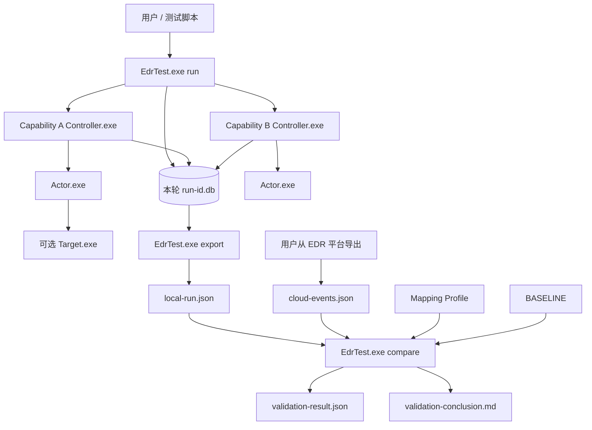
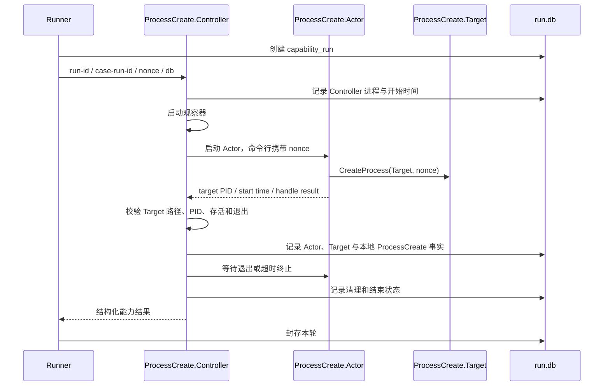
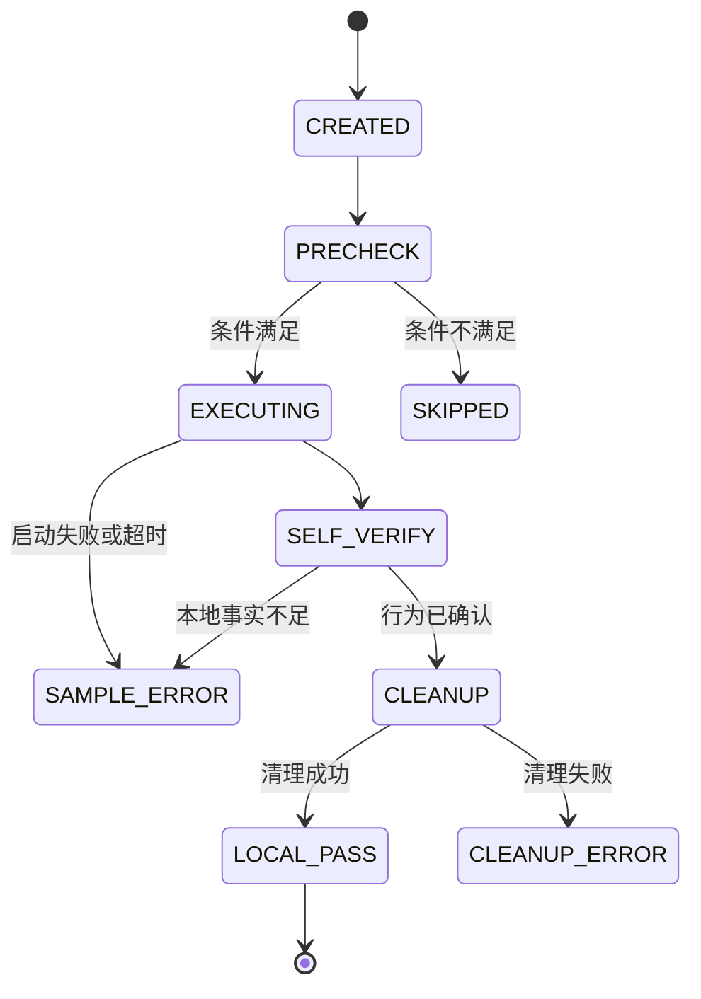

# EDR 能力离线验证平台详细设计方案

| 属性 | 内容 |
| --- | --- |
| 文档状态 | Draft，作为首期实现基线 |
| 版本 | 0.2.0 |
| 日期 | 2026-08-05 |
| 首期平台 | Windows 10/11、Windows Server 2019/2022，x64 |
| 验证模式 | 本地执行并记录，用户导入 EDR 平台导出的 JSON，离线比较 |
| 目标产品 | 首个映射为腾讯 EDR，但框架不调用腾讯 EDR API |

## 1. 设计结论

平台调整为完全离线的三段式工作流：

1. **能力执行**：每个能力包标配一个控制/观察程序和一个或多个行为参与程序。控制程序生成唯一测试信息、启动行为、监控结果并写入本轮 SQLite 数据库。
2. **结果导出**：每轮测试使用独立 `.db` 文件，一轮可顺序执行一个或多个能力；导出工具把本地事实转换为稳定、可审计的 JSON。
3. **离线验证**：用户从 EDR 平台手工导出对应主机和时间窗口的 JSON 日志；比较工具按版本化映射将云端日志规范化，再与本地 JSON 和 BASELINE 比较，同时输出结构化 JSON 验证结果和中文 Markdown 结论。

首版明确不建设腾讯 EDR 鉴权、API 查询、轮询或在线 Collector。这样可降低接口依赖和凭据风险，也与当前已有的控制台 JSON 导出能力一致。

核心技术决策：

- 全部平台工具和首期 Windows 程序优先采用 C# / .NET 8；
- `EdrTest.exe run` 只负责编排一轮测试，不直接产生被测能力行为；
- 每项能力必须有独立的 `*.Controller.exe`；
- 行为侧至少一个 `*.Actor.exe`，按能力需要增加 `*.Target.exe` 或 `*.Helper.exe`；
- Controller 是能力记录的唯一责任者，Actor/Target 不直接写数据库；
- 每轮一个 SQLite 数据库，默认串行执行能力，先保证可重复和低噪声；
- 本地导出 JSON、云端原始 JSON、映射版本和 BASELINE 共同决定验证结果；
- “本地行为失败”“云端事件未发现”“云端导出范围不足”严格区分。

## 2. 术语

| 术语 | 定义 |
| --- | --- |
| Test Run / 测试轮次 | 一次测试会话，对应唯一 Run ID 和唯一 SQLite 数据库，可包含多个能力 |
| Capability / 能力 | 被验证的遥测能力，例如进程创建、文件创建、注册表修改 |
| Capability Package / 能力包 | 某能力的 Controller、Actor、可选 Target/Helper、清单和资源 |
| Runner / 轮次编排器 | 创建一轮数据库、选择能力、调度 Controller、最终封存数据库 |
| Controller / 控制观察程序 | 每项能力专属，生成标记、启动 Actor、监控行为、自验证、清理、记录事实 |
| Actor / 行为执行者 | 真正发起系统行为的程序 |
| Target / 被执行对象 | 某些能力中的行为对象，例如进程创建中的子进程 |
| Local Fact / 本地事实 | 由 Controller 直接观测并写入 SQLite 的进程、文件、注册表或网络事实 |
| Cloud Event / 云端事件 | 用户从 EDR 平台导出的原始 JSON 事件 |
| Mapping Profile / 映射配置 | 把特定版本的云端字段映射为平台规范化字段 |
| BASELINE / 检验基准 | 定义本地行为必须成立的条件和云端事件必须满足的条件 |

## 3. 目标与边界

### 3.1 目标

- 建立每项能力独立、可执行、可监控、可清理的能力包；
- 通过本地事实证明行为真实发生，不能只依赖进程退出码；
- 一轮测试可选择一个或多个能力并在同一个数据库中留痕；
- 支持把每轮数据库确定性导出为 JSON；
- 支持用户导入任意大小的 EDR JSON 导出文件；
- 通过映射配置兼容腾讯 EDR 字段变化，不把厂商字段写死在比较核心；
- 输出事件覆盖、字段完整性、关联可信度和时间差异；
- 所有结论都能回溯到本地事实、云端原始记录和逐条断言。

### 3.2 非目标

- 不调用腾讯 EDR API，不保存腾讯 EDR 账号或密钥；
- 不自动登录或操作 EDR 控制台；
- 不验证拦截、告警、处置或 MDR 服务质量；
- 首期不测试进程注入、驱动、凭据访问、VSS 删除或 Agent 停止等高风险能力；
- 不把用户导入的原始云端日志复制进 Git 仓库；
- 不在首期提供集中式服务器、PostgreSQL 或远程 Worker。

## 4. 参考日志分析与设计影响

本地 `reference/EDR事件导出示例.json` 是顶层 JSON 数组，当前样例约 9.9 MB、1760 条事件，特征如下：

- `@table` 全部为 `ProcEvents`；
- `Action.Name` 包含 1744 条 `ProcessCreate`、13 条 `ProcessHandleObject`、3 条 `RemoteThread`；
- 字段使用点号扁平命名，例如 `Common.EventTime`，不是嵌套对象；
- `Common.EventTime`、`Child.ProcCreateTime`、`Parent.ProcCreateTime` 为 Unix 毫秒；
- `Common.EventUUId` 在进程创建样例中可作为云端事件唯一标识；
- `Common.Mid` 和 `Environment.HostName` 可用于主机过滤；
- `Child.*` 描述新创建进程，`Parent.*` 描述创建者，`PParent.*` 描述更上层进程；
- `Child.ProcCmdline` 与 `Parent.ProcCmdline` 大多数记录有值，但不能假定永远存在；
- PID 在导出时间窗内会复用，不能只按 PID 匹配。

对“进程创建”能力，三程序模型与日志天然对应：

```text
ProcessCreate.Controller.exe
  └─ 启动 ProcessCreate.Actor.exe
       └─ 创建 ProcessCreate.Target.exe

云端目标事件：
  Parent.*  ≈ Actor
  Child.*   ≈ Target
  PParent.* ≈ Controller（作为辅助，不作强制假设）
```

首个映射配置见 `mappings/tencent-edr-proc-events-v1.yaml`。样例文件本身位于忽略目录，不进入版本控制。

## 5. 总体架构



平台分成两个时间上解耦的阶段：

- 执行阶段只需要 Windows 测试机和能力包；
- 比较阶段可以在另一台机器上离线完成，只需要本地导出 JSON、云端 JSON、映射和 BASELINE。

## 6. 可执行程序编排

### 6.1 全局工具

| 程序 | 职责 |
| --- | --- |
首版使用一个 `EdrTest.exe` 和多个子命令，降低发布、版本和依赖管理成本；逻辑职责仍然隔离：

| 命令 | 职责 |
| --- | --- |
| `EdrTest.exe run` | 创建 Test Run、选择能力、生成 Run ID、调度 Controller、封存数据库 |
| `EdrTest.exe export` | 读取已封存 `.db`，校验结构并导出本地 JSON |
| `EdrTest.exe compare` | 规范化用户导入的云端事件、执行 BASELINE、输出结果 JSON 与中文 Markdown 结论 |
| `EdrTest.exe inspect` | 查看数据库摘要、能力状态和清理情况，不修改数据库 |

### 6.2 每项能力的两类程序

每个能力包必须包含以下两类程序：

1. **Controller 类**：固定一个能力专属 EXE。负责测试标识、前置检查、行为启动、本地监控、事实保存、超时和清理。
2. **Behavior 类**：一个或多个行为参与 EXE。`Actor` 必需；`Target` 和 `Helper` 按能力可选。

因此“进程创建”能力有三个 EXE：

```text
ProcessCreate.Controller.exe   # 控制/观察
ProcessCreate.Actor.exe        # 调用 CreateProcess 创建子进程
ProcessCreate.Target.exe       # 被创建对象，保持短暂存活并安全退出
```

“文件创建”通常只需两个 EXE，因为被操作对象是文件：

```text
FileCreate.Controller.exe
FileCreate.Actor.exe
```

### 6.3 Controller 职责

Controller 接收 Runner 下发的固定参数：

```text
--run-id <uuid>
--case-run-id <uuid>
--nonce <128-bit marker>
--run-db <absolute-path>
--work-dir <absolute-path>
--manifest <absolute-capability-json-path>
--package-dir <absolute-package-path>
--parameters <absolute-json-path>
--timeout-ms <integer>
```

Controller 必须：

1. 校验能力包清单、程序 SHA-256、运行目录和权限；
2. 将 Controller 自身进程信息写入数据库；
3. 生成带 `run_id + case_id + nonce` 的命令行和工件名；
4. 启动本地观察器后再启动 Actor，避免丢失瞬时事件；
5. 通过进程句柄、文件状态、注册表读取或本地服务回执验证行为；
6. 记录 Actor/Target 的 PID、路径、命令行、开始/结束 UTC、退出码和文件 hash；
7. 对每条本地事实标记观测来源和可信度；
8. 无论成功失败都执行清理，并记录清理前后证据；
9. 返回结构化退出码，不以控制台文本作为唯一接口。

Controller 是能力数据的唯一写入者。Actor、Target、Helper 通过匿名管道、命名管道或受控 stdout 返回小型 JSON 消息，不直接打开本轮 SQLite 数据库。

### 6.4 Behavior 程序约束

- 只执行单一、明确的行为；
- 不选择测试范围，不访问 BASELINE，不决定 PASS/FAIL；
- 不直接写 SQLite；
- 接收 nonce 并尽可能写入命令行、工件名或协议数据；
- 支持硬超时和父进程退出联动；
- 默认不访问公网、不下载内容、不修改系统关键路径；
- 输出使用版本化 JSON 消息，stderr 只用于诊断；
- 提供源码、确定性构建配置和 SHA-256 清单。

### 6.5 Runner 职责与并发

Runner 负责“轮次”，Controller 负责“能力”。Runner 不替代能力 Controller。

默认按用户选择顺序串行执行能力，相邻能力默认等待 3 秒（可配置为 0–300 秒），原因是：

- 降低 EDR 背景噪声和能力间相互影响；
- 避免多个进程写 SQLite 的竞争；
- 更容易确定每个能力的时间窗；
- 清理失败时可以立即停止后续能力。

后续可增加 `--parallel N`。并行时启用 SQLite WAL、`busy_timeout` 和短事务，并要求每个能力使用独立工作目录和 nonce。L2/L3 能力永不与其他能力并行。

## 7. 进程创建能力时序示例



本地必须记录的最小事实：

- Controller、Actor、Target 的绝对路径和 SHA-256；
- 三者 PID，Actor/Target 的进程创建 UTC；
- Actor 和 Target 的完整命令行；
- Actor 观测到的 `CreateProcess` 返回值；
- Controller 通过进程句柄独立确认的 Target 身份；
- nonce、测试开始/结束、超时和退出码。

各能力的完整采集字段、参考云端字段对应关系和 JSON 路径见
`docs/LOCAL-OBSERVATION-DESIGN.md`。轮次导出使用
`schemas/run-export.schema.json`，分类事件的 `data` 使用
`schemas/local-event-data.schema.json`。

## 8. 测试轮次与状态机

### 8.1 一轮测试

文件布局：

```text
runs/<yyyyMMdd>/<run-id>/
  <run-id>.db
  work/<case-id>/
  export/local-run.json
  import/cloud-events.json
  import/cloud-export-manifest.json
  result/validation-result.json
  result/validation-conclusion.md
```

其中 `runs/` 为本地制品目录，应由 `.gitignore` 排除。

数据库命名必须包含 Run ID，禁止固定使用 `result.db`。Run ID 使用 UUIDv7；时间字段统一保存 UTC，同时记录本机时区和单调时钟耗时。

### 8.2 状态机



云端验证是后置阶段，不改变 `LOCAL_PASS`。比较结果单独记录 `PASS / PARTIAL / FAIL / INCONCLUSIVE`。

## 9. SQLite 设计

### 9.1 原则

- 每轮一个数据库，一个数据库只允许一个 `run` 主记录；
- `PRAGMA foreign_keys=ON`；
- 执行期间使用 WAL；封存前执行 checkpoint，最终交付以单个 `.db` 为准；
- 写入使用参数化 SQL、短事务和 `busy_timeout`；
- 数据库通过 `PRAGMA user_version` 管理 Schema 版本；
- 保存结构化字段和必要的 JSON 扩展，关键关联字段不能只塞进 JSON；
- 数据库封存后计算 SHA-256，导出工具默认只读打开；
- 不把云端完整原始日志写入本地运行数据库，比较报告只记录输入文件 hash 和证据定位。

首版 DDL 见 `schemas/run-db.sql`。

### 9.2 核心表

| 表 | 用途 |
| --- | --- |
| `run` | 本轮唯一主记录、环境快照、开始/结束、数据库状态 |
| `capability_run` | 本轮选择的每个能力及本地执行状态 |
| `program_instance` | Controller/Actor/Target/Helper 的路径、hash、PID、命令行和时间 |
| `local_event` | Controller 观测到的本地规范化行为 |
| `local_fact` | 可独立断言的 key/value 事实及可信度 |
| `artifact` | 文件、日志和证据的路径、类型、大小与 hash |
| `execution_log` | 结构化阶段日志，不保存秘密 |
| `cleanup_result` | 清理动作、前后状态和结果 |

### 9.3 事务边界

- Runner 创建 `run` 和 `capability_run` 后提交；
- Controller 每个生命周期阶段单独提交；
- 高频观察先在内存缓冲，再批量写 `local_event`；
- 状态更新与其关键证据在同一事务；
- 封存事务写结束时间和状态，之后不再修改事实表。

异常退出后，下一次 `inspect` 可识别未封存数据库。恢复只允许补做清理或标记 `ABORTED`，不能伪造已完成的事实。

## 10. 本地 JSON 导出

`EdrTest.exe export` 的输入是已封存数据库，输出是版本化 JSON。示例命令：

```powershell
EdrTest.exe export --db .\runs\...\<run-id>.db --out .\local-run.json
```

导出要求：

- 输出符合 `schemas/run-export.schema.json`；
- 数组按稳定键排序，同一数据库重复导出内容一致；
- 包含数据库 Schema、工具版本、Run ID、环境、能力、程序、本地事件、执行日志和工件摘要；
- 不内嵌大文件，只记录相对路径、大小和 SHA-256；
- 默认脱敏用户名、IP 等非关联字段；
- 导出前校验数据库已封存、外键完整、无 WAL 残留；
- 导出完成后输出 JSON 自身 SHA-256。

顶层结构：

```json
{
  "schema_version": "1.1",
  "run": {},
  "capabilities": [],
  "programs": [],
  "local_events": [],
  "local_facts": [],
  "artifacts": [],
  "cleanup_results": [],
  "execution_logs": [],
  "integrity": {}
}
```

`execution_logs` 保存 Runner 与 Controller 输出，并用 `case_run_id` 关联到具体能力；前端“已完成队列”还会从 SQLite 或本地导出中提取能力时间、程序 PID/父 PID/路径/命令行/哈希和本地事实，在页面刷新或服务重启后恢复结构化 BASELINE 证据及详细日志。

当一项能力包含不同文件类型、加载方式或其他可替代测试路径时，BASELINE 可为每个 `cloud_expectation` 声明稳定的 `method.id` 与中英可读标题，并通过 `method_selection.strategy: best` 启用最佳方法结论。比较器仍先把本地条件作为整项能力的绝对前置基准；本地失败不能被任何云端方法覆盖。云端方法分别关联、评分和验证，默认按 `PASS > PARTIAL > INCONCLUSIVE > FAIL` 选择状态最好的方法，状态相同时依次比较候选关联分数、时间差绝对值和 BASELINE 顺序。结果同时保存被选方法、选择提示及全部方法的逐字段证据，前端默认展开被选方法，其余方法可独立展开排查。

## 11. 云端 JSON 导入

### 11.1 用户操作流程

1. 在带 EDR Agent 的隔离测试机运行一轮能力测试；
2. 使用 Export 工具生成 `local-run.json`；
3. Compare 工具根据本轮主机和时间生成建议导出范围；
4. 用户在 EDR 平台选择对应主机、事件类型和时间窗，导出 JSON；
5. 用户把 JSON 放入本轮 `import/`，可选填写 `cloud-export-manifest.json`；
6. Compare 工具离线比较并输出 `validation-result.json` 与 `validation-conclusion.md`。

建议时间窗：本轮最早能力开始前 60 秒，到最晚能力结束后 5 分钟。具体余量可在 BASELINE 中覆盖。

### 11.2 导出范围证明

“云端没有命中事件”只有在导出范围完整时才能判为 `FAIL`。建议使用 `schemas/cloud-export-manifest.schema.json` 记录：

- EDR 产品和导出格式版本；
- 导出操作时间；
- 查询开始/结束 UTC；
- 主机筛选条件；
- 事件表/类型筛选；
- 原始 JSON 文件名和 SHA-256。

如果没有 manifest，Compare 会从映射配置声明的事件时间、主机 ID 和主机名字段推断覆盖范围。同一主机的日志时间能够包住本地能力执行窗口时标记为 `inferred`；否则标记为 `insufficient`，此时未命中结果为 `INCONCLUSIVE`，而不是 `FAIL`。manifest 的查询窗口、主机条件及源文件 hash/大小均通过校验时标记为 `verified`。

### 11.3 大文件与容错

- 使用 `System.Text.Json` 的流式读取，不一次性反序列化全部日志；
- 首期支持顶层数组、JSONL 两种容器；
- 自动检测 UTF-8 BOM，拒绝无法确定的编码；
- 单条坏记录记录偏移和错误，默认使结果 `INCONCLUSIVE`；
- 保留原始记录序号和事件唯一 ID，报告不复制无关记录；
- 文件读取采用只读共享模式，比较过程中不改写用户原始文件。

## 12. 映射与规范化

比较核心只认识 Canonical Event，厂商字段由 Mapping Profile 转换。

进程创建的首版映射：

| Canonical 字段 | 腾讯 EDR 导出字段 |
| --- | --- |
| `event.id` | `Common.EventUUId` |
| `event.type` | 常量 `process` |
| `event.action` | `Action.Name` 映射 `ProcessCreate -> create` |
| `event.created` | `Common.EventTime`，Unix ms |
| `host.id` | `Common.Mid` |
| `host.hostname` | `Environment.HostName` |
| `process.pid` | `Child.ProcPid` |
| `process.entity_id` | `Child.ProcGuid` |
| `process.executable` | `Child.FilePath` |
| `process.name` | `Child.FileName` |
| `process.command_line` | `Child.ProcCmdline` |
| `process.start` | `Child.ProcCreateTime`，Unix ms |
| `process.hash.md5` | `Child.FileMd5` |
| `parent_process.pid` | `Parent.ProcPid` |
| `parent_process.entity_id` | `Parent.ProcGuid` |
| `parent_process.executable` | `Parent.FilePath` |
| `parent_process.command_line` | `Parent.ProcCmdline` |

映射配置必须包含：格式标识、记录选择器、字段映射、枚举映射、时间单位、路径规范化、缺失字段策略和映射版本。

Normalizer 不得静默丢弃未知字段；报告记录未映射字段数，但只在证据片段中保存必要的原始字段。

## 13. JSON 比较引擎

示例：

```powershell
EdrTest.exe compare `
  --local .\local-run.json `
  --cloud .\EDR事件导出.json `
  --cloud-manifest .\cloud-export-manifest.json `
  --mapping .\mappings\tencent-edr-proc-events-v1.yaml `
  --baseline .\baselines\windows\process_create.yaml `
  --out .\validation-result.json `
  --conclusion-out .\validation-conclusion.md
```

### 13.1 比较步骤

1. 校验本地 JSON、云端文件、manifest、mapping 和 BASELINE；
2. 将本地运行结果作为绝对检验基准，校验 `LOCAL_PASS` 以及全部 `local_requirements`；异常会影响最终结论，但仍可保留云端候选用于诊断；
3. 计算每项能力的主机和宽时间窗口；
4. 流式扫描云端日志，先按主机和宽时间窗口召回记录；不得把厂商 `Action.Name` 当作候选入口；
5. 将候选规范化为 Canonical Event；厂商映射可为已知 Action 提供精确语义，同时必须提供不依赖 Action 的候选发现路由；
6. 以本地文件路径、程序路径/命令行、PID 等身份锚点为核心，并计算 EDR 事件与本地行为的绝对时间差。每份 BASELINE 必须声明 `correlation.max_time_difference_ms`，当前精确采集能力使用 `15` ms；达到该阈值计为一项强时间证据，但必须同时至少命中一个文件、程序或 PID 身份锚点，时间接近不能单独形成可靠关联。`event.type`/`event.action` 默认只作展示提示。一个能力含多个行为子项时，可由每个 `cloud_expectation.correlation` 覆盖关联锚点、本地发生时间和时间差上限；
7. 用户可以按能力配置一个或多个厂商原始 `Action.Name` 标准；五项文件能力还可以配置原始 `Child.FileCreateOpName` 标准。每个字段内的多个值采用“任选其一”语义，两个字段同时配置时必须在同一候选上共同满足。参数只读取 EDR 原始 JSON，不参与候选召回和锚点评分，也绝不改变本地运行规则、`LOCAL_PASS` 或 `local_requirements`；它们只对已达到本地锚点阈值的 EDR 候选进行二次筛选，不符的强锚点候选仍完整保留供核对；
8. 优先选择同时通过本地锚点阈值与可选 Action 标准的唯一最佳候选执行字段、数量和时间断言；若没有强匹配，仍保留时间相近、仅命中部分文件/程序条件的低置信度 JSON 块，并继续比较所有可读取字段。某个 EDR 字段缺失只影响该字段，不得中止后续断言；
9. 检查云端导出范围是否足以支持“未发现”结论；
10. 输出逐能力结果、逐字段结果、当前能力的本地导出 JSON 块、排序后的完整候选日志、逐候选 BASELINE/自定义 Action 匹配位置、输入 hash 和中文总体结论。

### 13.2 关联锚点

进程创建建议：

```text
强锚点：Target 绝对路径 + Target 命令行 nonce
强锚点：Actor 绝对路径 + Actor 命令行 nonce
中锚点：Target PID + 创建时间容差
中锚点：Actor PID + Target PID + 父子关系
弱锚点：文件名 + 主机 + 宽时间窗
```

PID 不能单独形成 PASS。Windows 路径比较需统一分隔符、大小写和设备路径前缀，但报告同时保留原始值。

时间方向按 `edr.event.created - local.occurred_at_utc` 计算并保存为 `time_offset_ms`：负数表示 EDR 早于本地行为（提前），正数表示 EDR 晚于本地行为（延后），零表示时间一致。阈值仍按其绝对值 `time_distance_ms = abs(time_offset_ms)` 判断；`≤ max_time_difference_ms` 会增加 100 分强证据，并在 EDR 条件中产生独立的 required 结果。超过上限时即使路径和 PID 一致，也不能得到 PASS。时间证据只有与至少一个身份锚点同时命中时才能帮助候选达到关联阈值。

本地运行日志是绝对基准，正常情况下应完整提供路径、程序身份、PID 和发生时间。候选分层只描述云端记录与这些本地条件的关联程度：高/中置信度候选可进入自动判定；低置信度候选只供继续排查，不能因为时间接近或 `Action.Name` 相同就自动通过。

离线比较页允许按 `capability_id` 填写逗号分隔的 `Action.Name` 精确值并保存到本机浏览器；`Child.FileCreateOpName` 入口只为 `win.file.create/open/delete/modify/rename` 五项文件能力显示，后端也拒绝其他能力配置该字段。未配置时行为与纯本地锚点关联完全一致；配置后，原始字段成为强候选的附加必需条件。报告必须记录本次实际使用的标准、候选原始值和匹配结果。原始字段匹配不能把未命中本地锚点的记录提升为可靠候选。

前端首次使用时预填以下规则；用户可以编辑或清空，留空不会生成请求参数，也不会启用隐式筛选：

| 能力 | 默认 `Action.Name` | 默认 `Child.FileCreateOpName` |
| --- | --- | --- |
| 文件创建 | `FileWriteClose` | `新建文件` |
| 文件修改 | `FileWriteClose` | `覆盖写文件` |
| 文件打开 | `FileWriteClose` | `打开文件` |
| 文件重命名 | `FileRename` | 留空 |
| 进程创建 | `ProcessCreate` | 不适用 |
| 远程线程创建 | `RemoteThread` | 不适用 |
| 进程访问 | `NtOpenProcess` | 不适用 |
| 进程篡改活动（进程修改） | `WriteProcessMemory` | 不适用 |
| 本地账号创建 | `AccountCreate` | 不适用 |
| 账号登录 | `LoginSuccess`、`LoginFailed`、`LoginExplicitCredentials` | 不适用 |

文件删除以及表中未列出的其他能力默认全部留空。

同一能力一次产生多条同类事件时，例如 DLL 加载能力的三个子项，应在各自的 `cloud_expectation.correlation` 中使用子项路径、文件名和 PID，并通过 `time_from_local` 指向该子项的本地发生时间。子项级锚点优先于能力级公共锚点，既防止事件互相替代，也能让候选按各自时间距离排序。

如果多个候选的锚点得分和时间距离均相同而无法唯一选择，结果为 `INCONCLUSIVE`。比较器不得按数组第一条或最新一条盲选。

离线比较页的“可选消歧”和“BASELINE”面板默认收起。BASELINE 目录与比较结果都按能力大类形成第一级折叠，再以具体能力形成第二级折叠；两处必须复用统一的中英文能力分类、顺序和未分类兜底，不能因结果中只出现部分能力而改变分类语义。

前端为每项能力提供只读 JSON 对照悬浮窗：左侧展示按 `case_run_id` 截取的本地运行导出块，右侧展示用户选择的 EDR 原始候选块。通过的本地要求、关联锚点、自定义 EDR 原始字段标准和云端断言使用后端提供的 JSON Pointer 精确高亮；参与时间差计算的本地时间戳与 EDR 原始时间戳使用独立颜色在两侧同时高亮，即使该时间差超出阈值也仍保留高亮。候选切换会同步重算显示该候选自己的命中字段，但不会人工篡改自动验证结论。

### 13.3 断言操作符

首期支持：

```text
present, absent, equals, not_equals, contains, regex,
one_of, range, cidr, timestamp_between, ref_equals
```

`ref_equals` 用于把云端字段与本地字段比较，例如：

```text
cloud.process.pid == local.programs[target].pid
cloud.parent_process.pid == local.programs[actor].pid
```

## 14. BASELINE 设计

BASELINE 同时定义两层条件：

1. `local_requirements`：Controller 必须保存哪些本地事实，行为怎样才算真实发生；
2. `cloud_expectations`：云端应出现哪些事件、字段和值。

BASELINE 不包含腾讯字段名；腾讯字段只出现在 Mapping Profile 中。这样同一个能力 BASELINE 可以复用于其他 EDR 产品。

比较时必须使用 `capability.id` 和 `capability.version` 同时选择 BASELINE，版本必须完全一致。若只存在同 ID 的其他版本，结果应为 `NOT_COMPARED` 并给出版本不匹配提示；不得套用新版新增条件，把旧能力包运行结果误判为本地采集失败。能力包重新构建时直接替换对应 `samples/<capability-id>/` 目录，确保可执行文件、依赖和清单来自同一版本。

每条云端断言分为：

- `required`：缺失或错误导致能力失败；
- `recommended`：能力可判 `PARTIAL`；
- `informational`：只记录，不影响结论。

能力程序构成由版本化 Capability Manifest 描述，Schema 见 `schemas/capability-manifest.schema.json`。实际能力包位于被忽略的本地 `samples/` 工作区或独立受控制品库。

本地引用采用两种稳定路径：`facts.<fact_key>` 从当前能力的 `local_fact` 索引解析；`programs.<role>.<field>` 从当前能力唯一的 Controller/Actor/Target 角色实例解析。存在同角色多实例时必须使用带实例名的引用，比较器不得自行任选。

## 15. 结果模型

### 15.1 本地结果

- `LOCAL_PASS`：行为已发生、自验证通过且清理成功；
- `SAMPLE_ERROR`：程序启动、行为执行或自验证失败；
- `CLEANUP_ERROR`：行为发生但清理失败；
- `SKIPPED`：平台、权限或安全条件不满足；
- `ABORTED`：Runner 或 Controller 非正常结束。

### 15.2 云端验证结果

- `PASS`：所有 required 事件和字段通过；
- `PARTIAL`：required 事件存在，但 recommended 字段或软目标不完整；
- `FAIL`：本地为 `LOCAL_PASS`、导出范围完整，但 required 事件或字段未满足；
- `INCONCLUSIVE`：导出范围不足、格式错误、映射失败或候选歧义；
- `NOT_COMPARED`：本地能力没有进入可比较状态。

### 15.3 指标

```text
事件覆盖率 = 命中的 required 云端事件数 / required 云端事件总数
字段完整率 = Σ(字段权重 × 通过值) / Σ字段权重
可判定率   = PASS/PARTIAL/FAIL 数 / 已请求比较的能力数
关联置信度 = 选中候选的锚点得分与冲突情况综合结果
```

离线模式不测“API 查询等待时间”。如果云端记录同时包含事件产生时间和平台收集时间，可报告这两个字段的差值，但需命名为“记录内采集时差”，不能宣称是平台端到端可见延迟。

## 16. 安全控制

| 等级 | 行为 | 默认策略 |
| --- | --- | --- |
| L0 | 用户目录、短生命周期进程、回环网络 | 可自动运行 |
| L1 | HKCU、命名管道、内网测试服务 | 实验室可自动运行 |
| L2 | 管理员权限、服务、计划任务、账户 | 审批并要求 VM 快照 |
| L3 | 注入、驱动、凭据、VSS、Agent 变更 | 首期不实现 |

强制要求：

- Runner 校验实验室主机标记，生产环境默认拒绝；
- 网络目标必须在 allowlist，默认只允许回环；
- 文件和注册表操作限定专用命名空间；
- 每个进程都有硬超时和进程树清理；
- 程序及能力清单记录 SHA-256；
- 数据库、导出和报告不得包含凭据；
- 云端日志可能含用户名、主机、路径和网络信息，默认仅本地处理并禁止提交 Git。

## 17. 推荐技术栈

| 层 | 首选 |
| --- | --- |
| Runner / Export / Compare | C#，.NET 8 |
| Windows 能力程序 | C# + Win32 P/Invoke；特殊场景可用小型 C/C++ |
| SQLite | `Microsoft.Data.Sqlite` |
| JSON | `System.Text.Json` 流式 API |
| YAML | `YamlDotNet` |
| Schema | JSON Schema Draft 2020-12 |
| CLI | 轻量内置参数解析，无额外依赖 |
| 日志 | SQLite `execution_log` 结构化记录 |
| 测试 | 无测试框架依赖的端到端测试程序 + Node 契约测试 |

发布以 `win-x64` 为首个 Runtime Identifier。开发构建可 framework-dependent；测试机分发包可 self-contained，是否启用 single-file 由体积和 EDR 行为影响测试决定。

## 18. 仓库结构

```text
.
├─ baselines/windows/        厂商无关的能力 BASELINE
├─ configs/                  离线运行与比较配置模板
├─ docs/                     设计与决策记录
├─ mappings/                 云端导出格式映射
├─ schemas/                  DB、Manifest、导出和事件 Schema
├─ src/
│  └─ EdrTest/               单一 CLI 与可供 Controller 引用的 SDK
└─ tests/
   ├─ EdrTest.Tests/         外部 Controller + 完整离线闭环
   ├─ contract/
   ├─ integration/
   └─ e2e/
```

本地 `reference/`、`samples/`、`EDR-Telemetry-main/` 和 `runs/` 均不追踪。可审计的官方能力样本源码与清单模板归档在 `sample-src/`，构建脚本将带 EXE SHA-256 的可运行能力包生成到本地 `samples/`；第三方或敏感样本仍可由独立制品库分发。

User Account Activity 五项能力统一使用本轮 nonce 派生的 `edrt…` 临时本地账号。Controller 在执行前确认账号不存在，Actor 使用 NetAPI 或 `LogonUserW` 产生行为，Controller 以账号名、SID、前后状态和令牌 AuthenticationId 形成绝对本地基准，最后仅删除本轮精确账号。密码只存在于工作目录内的短生命周期请求文件，不写入命令行、SQLite、JSON 导出或证据制品。能力清单声明管理员权限；启动与构建入口在非管理员环境给出推荐提权提示，Runner 权限预检负责在任何账号操作前安全跳过。

Network Activity 五项能力采用 Controller、Actor、Helper 三程序编排，全部流量限制在 IPv4 回环地址。Helper 先报告实际监听端点，Actor 再产生 TCP、UDP、HTTP、DNS 或 HTTP 下载行为；Controller 以双方 nonce、实际端点、Actor PID/路径和紧邻 API 调用的时间交叉确认本地事实。文件下载必须同时验证 HTTP 请求和受控落地文件，DNS 在 `127.0.0.1:53/UDP` 使用 `.invalid` 问题名和文档地址响应。五份 BASELINE 使用 15 ms 时间强证据；腾讯 260808 导出缺少 DNS 问题名时保留网络级证据并给出 `PARTIAL`，不得伪造查询语义。完整约束见 `docs/NETWORK-ACTIVITY-SAMPLES.md`。

## 19. 测试策略

### 19.1 Runner 与 SQLite

- 一轮一个 DB、多个能力顺序执行；
- 事务中断、进程崩溃、数据库锁和磁盘空间不足；
- WAL checkpoint 后只靠 `.db` 可完整读取；
- 外键、唯一约束、状态迁移和 `user_version`；
- 本地文件保留而数据库索引不泄漏忽略目录内容。

### 19.2 能力包

- 每个能力连续运行 20 次，本地行为成功率 100%；
- Actor/Target 启动失败、超时、异常退出和父进程终止；
- nonce、PID、路径和时间均被记录；
- 清理成功、清理失败和重试；
- 标准用户与管理员上下文按清单验证。

### 19.3 Export 与 Compare

- 同一 DB 重复导出结果确定；
- 顶层数组、JSONL、大文件、BOM、坏记录和未知字段；
- `ProcessCreate` 正反例、PID 复用、相同文件名、并发噪声；
- 云端范围不足时必须 `INCONCLUSIVE`；
- 映射版本变化使用金样契约测试；
- 所有 PASS/FAIL 都能定位原始记录序号与事件 ID。

## 20. 实施路线

### M0：数据契约和骨架（1 周）

交付：SQLite DDL、Capability Manifest、Run Export Schema、Cloud Export Manifest、腾讯进程事件映射、CLI 参数约定。

验收：所有 Schema 可校验；参考 JSON 可被流式解析并识别三类进程事件。

### M1：进程创建最小闭环（2 周）

交付：Runner、ProcessCreate Controller/Actor/Target、SQLite Store、Export、Compare。

验收：本地连续 20 次成功；能从参考格式 JSON 中唯一关联目标事件；缺失、噪声和范围不足结论正确。

### M2：基础能力扩展（2～3 周）

交付：进程退出/父子关系、文件创建/修改/重命名/删除、HKCU 注册表创建/修改/删除、回环 TCP/HTTP/DNS。

验收：一轮可选多个能力，数据库完整封存，每个能力独立导出和比较。

### M3：报告与稳健性（2 周）

交付：字段完整率、能力矩阵、JSON 报告、可选 HTML/JUnit、映射版本兼容和脱敏。

验收：结果可离线复算，输入 hash、版本和证据完整；格式错误不误判为产品能力缺失。

## 21. 待确认决策

1. Capability 源码是否放在独立私有仓库，还是仅发布签名二进制到 `samples/`；
2. 第一版只支持 .NET framework-dependent，还是同时发布 self-contained；
3. 云端导出时用户能否填写查询时间范围和主机筛选，从而形成完整 manifest；
4. 腾讯 EDR 导出格式是否会因事件大类、控制台页面或产品版本而变化；
5. 是否需要在 Compare 中提供人工确认候选事件的交互模式；
6. 测试轮次是否允许并行，首版建议固定为串行；
7. MIT 许可是否同样适用于后续独立分发的能力包。

## 22. 完成定义

一个能力只有在以下条件全部满足后才算完成：

- 独立 Controller 和至少一个 Actor 已实现；需要对象程序时包含 Target；
- Capability Manifest、程序 hash、权限和风险等级齐全；
- Controller 能证明本地行为、完整写入本轮 DB 并安全清理；
- 本地连续 20 次测试通过；
- BASELINE 同时包含本地要求和云端预期；
- 至少一个真实脱敏云端事件夹具通过 Mapping 契约测试；
- PASS、FAIL、PARTIAL、INCONCLUSIVE 和噪声场景有自动化测试；
- Run DB、local JSON 和验证报告都能回溯同一 Run ID；
- 比较结果记录所有输入文件 SHA-256、Schema 版本和映射版本。
