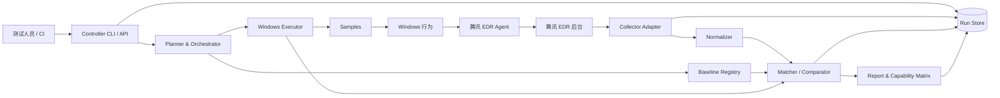
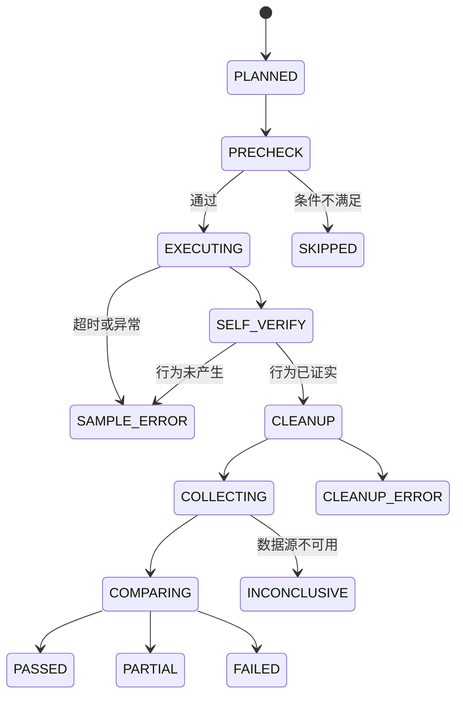

# 腾讯 EDR 能力自动化验证测试平台详细设计方案

| 属性 | 内容 |
| --- | --- |
| 文档状态 | Draft，作为首期实现基线 |
| 版本 | 0.1.0 |
| 日期 | 2026-08-04 |
| 首期平台 | Windows 10/11、Windows Server 2019/2022 |
| 目标产品 | 腾讯 EDR，适配接口待与产品侧确认 |

## 1. 摘要与核心决策

本项目建设一套可重复执行、证据可追溯、结果可解释的 EDR 遥测能力验证平台。一次完整验证由五个相互独立的结论组成：

1. 测试样本是否成功产生预期的系统行为；
2. 腾讯 EDR 是否在允许的时间窗口内采集到对应事件；
3. 事件是否能与本次运行可靠关联，避免把历史或并发噪声当作命中；
4. 关键字段是否存在且取值正确；
5. 事件上报延迟、重复率和跨事件关联是否满足基准。

首版选择以下架构：

- 控制面采用 Python 3.12 模块化单体，先提供 CLI，接口边界保持可服务化；
- Windows 样本优先使用 PowerShell 与小型 C# 原生程序，避免把 Atomic Red Team 作为强依赖；
- Windows 测试机内运行轻量执行器，负责前置检查、样本执行、自验证、清理和证据封装；
- 腾讯 EDR 数据接入实现为可插拔 Collector Adapter；在 API 未确认前同时支持离线 JSON/CSV 和 Mock Collector；
- BASELINE 使用 YAML 编写、JSON Schema 校验、Git 版本化；
- 所有厂商事件先映射为稳定的 Canonical Event，再执行规则比对；
- MVP 使用 SQLite 保存运行元数据，原始事件和报告保存在运行制品目录；团队化部署可切换 PostgreSQL 与对象存储；
- 参考 EDR-Telemetry 的分类和权重思想，但本项目的实测结果、字段级证据和版本上下文独立维护。

## 2. 背景、目标与非目标

### 2.1 背景

EDR 的检测、调查和溯源依赖进程、文件、注册表、网络及系统配置等终端遥测。产品文档中的“支持”通常不能回答默认配置是否生效、具体字段是否可查询、何时可见，以及版本升级后是否退化。必须以可控行为和可重复证据进行端到端验证。

目录中的参考项目包含 Windows 57 个遥测子类，覆盖 16 个大类；Windows 生成器通过 Atomic Red Team GUID 映射触发部分行为，并以 `Yes / Partially / Via EnablingTelemetry / Via EventLogs / No` 表达厂商能力。Linux/macOS 生成器则更多使用原生系统调用或系统 API，并记录本地执行结果。

这些资料带来四点设计结论：

- “能力矩阵”适合定义测试范围，但不能替代可执行 BASELINE；
- 单个攻击模拟可能同时触发多个遥测，样本和预期事件必须是一对多关系；
- 行为执行成功与 EDR 事件命中必须分开记录；
- 仅按事件类型判定会产生误命中，必须设计运行级关联标识和多字段匹配。

### 2.2 项目目标

- 建立安全、幂等、可自验证、可清理的 Windows 测试样本库；
- 建立事件类型、字段、时序、数量和延迟均可表达的版本化 BASELINE；
- 支持腾讯 EDR 的 API、导出文件或日志平台接入，并统一为规范化事件；
- 自动输出用例结论、证据、能力矩阵、字段缺口、延迟分布和版本对比；
- 支持在无 EDR 环境先验证样本，在有 EDR 环境执行端到端回归；
- 对样本版本、BASELINE 版本、产品版本、Agent 策略和测试环境进行完整留痕。

### 2.3 非目标

- 不评价恶意行为检测率、告警质量、处置能力或 MDR 服务；
- 首期不执行凭据访问、内核驱动、进程注入、破坏性操作等高风险行为；
- 首期不建设通用 SOAR，也不控制生产终端；
- 不直接继承参考项目中其他厂商的能力结论；
- 不以 GUI 抓取作为长期稳定的数据接口，GUI 自动化只可用作短期人工验证手段。

## 3. 设计原则

1. **证据优先**：每个结论必须能回溯到样本日志、本地观察证据、查询条件、原始 EDR 事件和匹配明细。
2. **三态隔离**：样本失败、未采集、无法判定是不同状态，禁止都归为 `FAIL`。
3. **安全默认**：默认只运行低风险样本；提权、联网和系统配置变更需要显式授权标签。
4. **适配器隔离**：腾讯 EDR 字段名、分页方式和鉴权不得泄漏到领域规则。
5. **配置即代码**：样本清单、BASELINE、Schema 和环境非敏感配置进入 Git 审查。
6. **版本可重复**：结果必须绑定 Git commit、样本摘要、BASELINE 版本和运行环境快照。
7. **时间不可信任**：记录控制器、执行器和 EDR 的时间偏移，匹配窗口包含可配置容差。
8. **最小权限**：只有确需管理员权限的用例才提升权限，并在隔离测试机执行。

## 4. 范围分层与优先级

### 4.1 首期 P0：基础遥测冒烟

| 领域 | 用例 | 本地判据 | EDR 关键判据 | 风险等级 |
| --- | --- | --- | --- | --- |
| 进程 | 创建、退出、父子关系 | PID、退出码、父 PID | image、pid、parent、command_line、user、timestamp | L0 |
| 文件 | 创建、修改、重命名、删除 | 路径/内容/hash/存在性变化 | action、path、process、user、timestamp | L0 |
| 注册表 | Key/Value 创建、修改、删除 | HKCU 测试路径实读 | action、key、value、process、user | L1 |
| 网络 | DNS 查询 | 本地解析结果 | query、process、timestamp | L0 |
| 网络 | TCP 连接 | 本地测试服务接受连接 | destination、port、protocol、process | L0 |
| 网络 | HTTP 请求 | 本地 HTTP 服务收到 nonce | url/host、method（若支持）、process | L0 |

网络样本默认只访问测试机回环地址或明确配置的内网靶机，禁止默认访问公网。

### 4.2 P1：系统行为

计划覆盖服务、计划任务、PowerShell Script Block、WMI、BITS、Named Pipe、本地账户，以及文件下载。用例按 L1/L2 管理，要求管理员权限、快照和更严格的清理验证。

### 4.3 P2：高级或高风险行为

驱动加载、进程访问/注入、VSS 删除、Agent 停止/卸载、策略变更等列为 L3。只有在独立实验室、审批完成、快照可恢复且腾讯 EDR 产品方确认后才进入执行计划；默认流水线永不选择 L3。

## 5. 总体架构



### 5.1 部署形态

**MVP 单机形态**：控制器和执行器都运行在 Windows 实验测试机，适合样本开发、离线事件导入和小规模 EDR 验证。

**团队形态**：控制器部署在管理节点；Windows 执行器作为受控 Worker 运行在一个或多个隔离 VM；通过 HTTPS/mTLS 领取签名任务并回传证据。控制器不得任意下发 Shell 文本，只能下发仓库中已登记、摘要匹配的 Sample ID 和参数。

## 6. 模块设计

### 6.1 CLI / API

职责：提供计划预览、执行、恢复、事件重采集、重新比对、报告生成和基线校验入口。

规划命令：

```text
edr-validate baseline lint [path]
edr-validate sample verify <sample-id> --environment lab
edr-validate plan --suite <suite> --environment <env>
edr-validate run --suite <suite> --environment <env>
edr-validate collect <run-id> [--until <time>]
edr-validate compare <run-id> [--baseline-ref <git-ref>]
edr-validate report <run-id> --format html,json,junit
```

`plan` 必须显示风险等级、提权要求、联网目标、预计变更和清理动作；L2/L3 在执行前要求不可伪造的审批记录。

### 6.2 Planner 与 Orchestrator

职责：解析测试套件、过滤平台和风险等级、建立 Run/CaseRun、调度执行、轮询事件、触发比对并持久化状态。

用例状态机：



进程崩溃后可从最后一个持久化状态恢复。清理动作必须放入 `finally` 路径，并允许单独执行 `cleanup`。

### 6.3 Sample Registry 与 Windows Executor

每个样本由实现文件和 `sample.yaml` 清单组成，不允许控制器根据 BASELINE 动态拼接任意命令。清单至少包含：

- `sample_id`、版本、平台、架构和入口点；
- 风险等级 `L0-L3`、所需权限、是否联网；
- 参数 Schema、默认超时和允许的目标范围；
- 前置检查、行为执行、自验证和清理入口；
- 预期副作用及最大持续时间；
- 产物路径和签名/摘要信息。

样本输出统一 JSON Lines，关键记录如下：

```json
{"phase":"execute","status":"started","run_id":"...","case_id":"win.file.create","nonce":"...","time":"..."}
{"phase":"execute","status":"succeeded","observed":{"path":"C:\\EDRLab\\..."}}
{"phase":"self_verify","status":"succeeded","evidence":{"exists":true,"sha256":"..."}}
{"phase":"cleanup","status":"succeeded"}
```

样本质量要求：

- 幂等：重复运行不会因遗留状态得到假成功；
- 唯一：所有工件包含 `run_id + case_id + nonce`；
- 自证：通过 API/系统状态读取证明行为发生，而非仅以命令退出码判断；
- 可清理：清理前后都有证据，失败时给出人工恢复指引；
- 确定：固定输入、固定超时、固定工作目录，禁止下载未锁定内容；
- 可审计：脚本启用严格错误处理，小型二进制提供源码与可复现构建方式。

### 6.4 Baseline Registry

BASELINE 描述“在给定上下文中，应观察到什么”，不描述腾讯 EDR 的查询实现。其版本随 Git 管理，包含：

- 用例身份、适用 OS/Agent/策略条件和风险等级；
- 样本引用及参数；
- 查询时间窗与最大上报延迟；
- 一个或多个预期事件、数量、顺序和关联关系；
- 必填、推荐和信息字段断言；
- 可接受的厂商差异与已知限制；
- 评分权重、维护人、评审记录和变更原因。

三种字段严重度：

- `required`：缺失或错误导致该预期事件失败；
- `recommended`：事件仍可判为 `PARTIAL`，并记录字段缺口；
- `informational`：只统计，不影响结论。

断言操作符首期支持：`present`、`absent`、`equals`、`not_equals`、`contains`、`regex`、`one_of`、`range`、`cidr`、`timestamp_between`、`ref_equals`。字符串比较默认在规范化后进行，原始值始终保留。

BASELINE 示例见 `baselines/windows/file_create.yaml`，机器校验规则见 `schemas/baseline.schema.json`。

### 6.5 Collector Adapter

统一接口：

```text
healthcheck() -> CollectorHealth
resolve_host(host_identity) -> VendorHostIdentity
query(host, start, end, cursor, event_hints) -> EventPage
get_raw(event_id) -> RawEvent
```

首期实现顺序：

1. `mock`：以固定事件夹具验证编排和比对；
2. `file`：导入控制台导出的 JSON/JSONL/CSV，支持字段映射模板；
3. `tencent_api`：待确认鉴权、检索 API、分页、限流和事件保留策略后实现；
4. 可选 `log_platform`：若事件已汇聚到日志平台，则实现其查询适配器。

Collector 必须记录查询起止时间、服务端 request ID、分页游标、重试次数、限流信息和原始响应摘要。鉴权信息只从环境变量或密钥服务读取，不进入仓库、日志或报告。

轮询采用截止时间模型：样本结束后按退避策略查询，直到所有 required 事件命中或超过 `max_ingest_delay`。超时后再执行一次带安全余量的最终查询，防止边界丢失。

### 6.6 Normalizer

Normalizer 将厂商事件转换为 Canonical Event。标准结构包含：

- 标识：`event_id`、`event_type`、`event_action`、`category`；
- 时间：事件产生、Agent 观察、后台接收、采集器获取四类时间；
- 主机：hostname、host ID、OS、IP、Agent ID/版本；
- 主体：process、parent process、user；
- 客体：file、registry、network、dns；
- 关联：run/case/nonce 命中痕迹、process entity ID；
- 来源：collector、vendor、raw reference、mapping version；
- 扩展：无法标准化但需保留的厂商字段。

`schemas/normalized-event.schema.json` 定义最小数据契约。Normalizer 不应静默丢弃未知字段；映射失败产生告警和覆盖率指标。

### 6.7 Matcher / Comparator

比对分四步执行：

1. **候选召回**：按主机、宽时间窗、事件类型提示抓取候选；
2. **关联过滤**：优先匹配 nonce、工件路径、命令行、DNS 名称、目标端口和进程树；
3. **断言求值**：检查字段值、数量、时间和事件间引用；
4. **歧义处理**：多个候选得分接近且无法唯一确定时标记 `INCONCLUSIVE`，不得自动取第一条。

匹配优先级：

```text
强锚点：nonce / 唯一工件全路径 / 唯一 DNS 名
  > 实体锚点：host + process entity ID + parent entity ID
  > 组合锚点：host + image + pid + 时间 + 参数
  > 弱锚点：仅事件类型 + 时间
```

弱锚点不能单独使 required 事件通过。每次匹配输出候选列表、排除原因、选中事件和逐条断言结果。

### 6.8 Run Store 与制品

领域实体：

- `EnvironmentSnapshot`：OS、补丁、时区、Agent 版本、策略 ID、时间偏移；
- `TestRun`：套件、Git commit、操作者、开始/结束时间、总体状态；
- `CaseRun`：样本版本、Baseline 版本、状态机、重试；
- `SampleEvidence`：标准输出、自验证和清理证据；
- `RawEvent` / `CanonicalEvent`：原始与规范化事件；
- `AssertionResult`：期望、实际、严重度、证据引用；
- `ReportArtifact`：JSON、HTML、JUnit、摘要。

每次运行目录建议：

```text
artifacts/runs/<run-id>/
  manifest.json
  environment.json
  cases/<case-id>/sample.jsonl
  cases/<case-id>/local-evidence.json
  raw-events/<page>.json.gz
  canonical-events.jsonl
  match-results.json
  report.json
  report.html
```

敏感字段在落盘前按配置脱敏；原始事件制品应加密保存并配置保留期限。

### 6.9 Report

报告输出：

- 运行摘要：产品/Agent/策略/OS/代码与 Baseline 版本；
- 用例结果：`PASS / PARTIAL / FAIL / SAMPLE_ERROR / CLEANUP_ERROR / INCONCLUSIVE / SKIPPED`；
- 能力矩阵：事件覆盖、字段完整性、默认/需配置、证据链接；
- 延迟指标：p50、p95、max、超时率；
- 数据质量：重复率、时间戳异常、实体关联缺失、Normalizer 未映射字段；
- 版本对比：新增、修复、退化、基线变化和环境变化；
- JUnit：供 CI 门禁使用；HTML：供人工审阅；JSON：供二次分析。

## 7. 关联标识设计

每个 CaseRun 生成：

```text
run_id  = UUIDv7
case_id = 稳定用例 ID，例如 win.file.create
nonce   = 128-bit 随机值的短编码
marker  = EDRTEST_<run-short>_<case-short>_<nonce>
```

marker 应尽可能同时出现在：

- 进程命令行参数；
- 文件名、文件内容或注册表 value；
- DNS 左侧标签、HTTP path/header；
- 样本日志和本地证据。

考虑到 EDR 不一定采集所有 marker，BASELINE 必须声明至少一组备用关联键。PID 可能复用，不能跨长时间窗单独作为关联依据。

## 8. 结果模型与评分

### 8.1 用例状态

- `PASS`：所有 required 事件和字段通过，时延在阈值内；
- `PARTIAL`：required 事件存在，但 recommended 字段、非关键关联或软延迟目标未满足；
- `FAIL`：样本已被本地证据确认成功，但 required 事件缺失或 required 断言失败；
- `SAMPLE_ERROR`：样本未成功产生行为，不能用于判断 EDR；
- `CLEANUP_ERROR`：行为已产生但未完全恢复环境，需要人工处理；
- `INCONCLUSIVE`：采集接口故障、时间严重漂移或事件歧义导致无法判断；
- `SKIPPED`：平台、权限、策略或审批条件不满足。

### 8.2 指标

设用例权重为 `w_i`：

```text
事件覆盖率 = Σ(w_i × required事件命中率_i) / Σw_i
字段完整率 = Σ(字段权重 × 通过值) / Σ字段权重
及时率     = 阈值内命中的 required 事件数 / 已命中的 required 事件数
可判定率   = 可得出 PASS/PARTIAL/FAIL 的用例数 / 已执行用例数
```

总体得分只在可判定率达到门槛后展示，避免采集器大面积故障时产生虚假的低能力分。建议能力状态映射：

- `Supported`：事件覆盖 100%，required 字段 100%；
- `Partial`：事件存在但字段、关联或时效不完整；
- `Not observed`：样本成功但事件未观察到；
- `Requires configuration`：只在明确记录的非默认策略下通过；
- `Not testable`：当前环境或接口无法验证。

参考项目的 feature weight 可作为优先级初值，但正式权重需要腾讯 EDR 使用场景负责人评审。禁止把不同 BASELINE 版本的总分直接比较；趋势报告必须先解释基线变化。

## 9. 本地无 EDR 验证方案

接入 EDR 前，每个样本需通过两层 Oracle：

1. **状态 Oracle**：直接读取目标系统状态，例如文件内容/hash、注册表值、监听端收到的数据、进程 PID/退出码；
2. **独立观察 Oracle**：使用 Windows 事件日志、ETW 或实验室 Sysmon（仅作为旁证）确认行为轨迹。

验收要求：

- 连续运行 20 次，行为成功率 100%；
- 中断、超时和重复执行后仍能清理；
- 并发运行时 marker 不冲突；
- 中文路径、空格路径、标准用户和管理员上下文均按用例声明工作；
- Windows 支持版本上有明确测试记录；
- 本地 Oracle 不依赖腾讯 EDR Agent。

任务管理器、regedit、Wireshark 可用于开发排查，但不作为自动化验收的唯一证据。

## 10. 安全控制

### 10.1 风险分级

| 等级 | 含义 | 默认策略 |
| --- | --- | --- |
| L0 | 用户目录/回环网络内的无害行为 | 可自动运行 |
| L1 | HKCU、小范围系统对象或内网靶机 | 允许在实验室自动运行 |
| L2 | 管理员权限、服务/计划任务/账户变更 | 明确审批、VM 快照 |
| L3 | 注入、驱动、凭据、VSS、Agent 防护变更 | 默认禁用，专项审批 |

### 10.2 强制护栏

- 执行器校验主机标签 `EDR_LAB=true`，生产域成员默认拒绝；
- 网络目标必须命中 allowlist，DNS marker 使用内部测试域；
- 文件/注册表操作限制在专用命名空间；
- 每个样本有硬超时、进程树终止和清理超时；
- L2/L3 要求 VM 快照 ID、审批 ID 和一次性运行授权；
- 禁止在参数或日志中输出 token、cookie、租户秘密；
- 样本包使用 SHA-256 清单；团队形态再加入代码签名；
- 高风险 Suite 不接入普通 CI 定时任务；
- 保留全局 kill switch，可阻止新任务并触发安全清理。

## 11. 配置与密钥

环境配置只保存非敏感信息：主机选择器、collector 类型、时间窗、网络 allowlist、风险上限和制品策略。示例见 `configs/environments.example.yaml`。

敏感配置通过环境变量或密钥管理系统注入，例如：

```text
EDR_VALIDATION_TENCENT_API_BASE_URL
EDR_VALIDATION_TENCENT_CLIENT_ID
EDR_VALIDATION_TENCENT_CLIENT_SECRET
```

启动时只报告密钥“已配置/未配置”，不打印值。报告中的用户名、IP、命令行和文件路径根据数据分级做掩码。

## 12. 推荐技术栈

| 层 | 首选 | 理由 |
| --- | --- | --- |
| 控制器 | Python 3.12 | 生态成熟、适合 API/数据处理/测试 |
| CLI/配置 | Typer + Pydantic Settings | 类型化参数与配置校验 |
| YAML/Schema | ruamel.yaml + jsonschema | 保留可读性并执行机器校验 |
| HTTP | httpx + tenacity | 超时、连接池与可控重试 |
| 存储 | SQLAlchemy + SQLite/PostgreSQL | MVP 与团队部署共用模型 |
| 报告 | Jinja2 + JSON/JUnit | 人工与 CI 双用途 |
| Windows 样本 | PowerShell 7 / C# .NET 8 | 系统 API 覆盖与可审计源码 |
| 测试 | pytest + hypothesis | 单元、契约和属性测试 |
| 质量 | Ruff + mypy + pre-commit | 快速、可重复的门禁 |

项目使用独立 Conda 环境；依赖安装统一通过 `python -m pip install`，不使用 `conda install` 修改项目依赖。

## 13. 仓库结构

```text
.
├─ .github/workflows/        CI（实现阶段加入）
├─ baselines/windows/        Windows BASELINE
├─ configs/                  环境与套件配置模板
├─ docs/                     设计、ADR、接入说明
├─ schemas/                  数据契约
├─ src/edr_validation/
│  ├─ cli/                   命令入口
│  ├─ domain/                领域模型与状态机
│  ├─ orchestration/         计划、执行与恢复
│  ├─ executors/             Windows Worker 协议
│  ├─ collectors/            mock/file/tencent 适配器
│  ├─ normalization/         厂商事件映射
│  ├─ matching/              候选召回与断言引擎
│  ├─ persistence/           Run Store
│  └─ reporting/             报告与能力矩阵
└─ tests/
   ├─ unit/
   ├─ contract/
   ├─ integration/
   └─ e2e/
```

本地 `reference/`、`samples/` 和 `EDR-Telemetry-main/` 作为需求参考、样本工作区或第三方资料使用，统一由 `.gitignore` 排除。样本的受控发布方式在实现阶段另行确定，不通过本仓库直接分发。

## 14. 测试策略

### 14.1 框架自身

- 单元测试：状态机、断言操作符、时间窗、评分、脱敏；
- 属性测试：事件顺序、重复事件、时间边界和空字段；
- Schema 测试：所有 BASELINE、样本清单和事件夹具必须验证通过；
- Collector 契约测试：分页、重试、429、空页、重复页和时区；
- Normalizer 金样测试：固定原始事件映射为固定 Canonical Event；
- Matcher 反例测试：历史噪声、PID 复用、并发 marker、多个近似候选；
- 集成测试：Mock Collector 端到端产生 JSON/HTML/JUnit；
- E2E：隔离 Windows VM + 腾讯 EDR，按风险等级分流水线执行。

### 14.2 回归门禁

- PR：lint、类型检查、单元/契约/集成、Schema 校验；
- 每日：Windows L0 本地样本稳定性；
- 每周或产品版本变更：腾讯 EDR P0 Suite；
- 手工审批：L2/L3 Suite；
- 退化规则：稳定 BASELINE 从 PASS 变为 FAIL，且环境/策略无变化时阻断发布并生成缺陷包。

## 15. 实施路线与验收标准

### M0：需求与接口确认（1 周）

交付：设计评审稿、字段映射草案、风险分级、实验室拓扑。

验收：确认腾讯 EDR 数据获取方式、可查询事件类型、鉴权、限流、时区、典型延迟、Agent/策略版本字段和数据保留周期。

### M1：框架内核与 Mock 闭环（2 周）

交付：CLI、领域模型、状态机、Baseline lint、Mock/File Collector、Normalizer/Matcher、JSON 报告。

验收：使用事件夹具覆盖 PASS/PARTIAL/FAIL/SAMPLE_ERROR/INCONCLUSIVE；可离线重复比对且结果确定。

### M2：P0 样本与本地验证（2～3 周）

交付：进程、文件、HKCU 注册表、回环 DNS/TCP/HTTP 样本，自验证和清理证据。

验收：每个样本连续 20 次成功；失败注入后可恢复；L0/L1 安全审查通过。

### M3：腾讯 EDR 适配与端到端（2～3 周，取决于 API）

交付：Tencent Collector、字段映射、P0 BASELINE、HTML/JUnit/能力矩阵。

验收：同一环境重复 5 轮结果稳定；每个结论可链接到原始事件；接口异常不会误判为产品缺失。

### M4：系统行为与团队化（持续迭代）

交付：P1 样本、集中调度、PostgreSQL、签名任务、趋势与退化检测。

验收：权限、审批、快照、kill switch 和并发隔离全部可验证。

## 16. 腾讯 EDR 接入待确认清单

以下问题会直接影响 Collector 和 BASELINE，需在 M0 关闭：

1. 是否提供事件检索 API；若提供，鉴权、分页、限流和查询最大时间范围是什么？
2. 控制台展示的是原始遥测、聚合事件还是告警相关事件？
3. 是否能稳定获取 host ID、Agent ID/版本、策略 ID 和事件唯一 ID？
4. 进程是否有跨事件稳定的 entity ID；父进程、命令行、用户 SID 是否可用？
5. 文件、注册表、DNS、网络事件的实际字段名和动作枚举是什么？
6. 事件时间、接收时间分别是什么时区和精度？典型与最坏上报延迟是多少？
7. 默认策略与开启额外遥测后的差异如何标识？
8. 是否允许实验用 marker 字符串，查询是否支持精确/模糊过滤？
9. 原始事件导出是否脱敏或截断；数据保留期多长？
10. 哪些样本会被防护阻断；被阻断时是否仍产生行为尝试遥测？

## 17. 风险与应对

| 风险 | 影响 | 应对 |
| --- | --- | --- |
| EDR API 不可用或不稳定 | 无法全自动采集 | 先支持文件导入；推动只读服务账号/API |
| 事件延迟波动 | 偶发 FAIL | 记录延迟分布、退避轮询、软硬阈值分离 |
| 字段/枚举随版本变化 | Normalizer 失败 | 映射版本化、未知字段告警、金样契约测试 |
| 历史噪声误命中 | 虚假 PASS | nonce、多锚点、歧义转 INCONCLUSIVE |
| 样本被 EDR 阻断 | 无法证明采集缺失 | 区分 attempt/behavior；记录防护结果与本地 Oracle |
| 清理不完整 | 污染后续测试 | 专用命名空间、finally 清理、快照、清理门禁 |
| 参考代码许可证限制 | 发布合规风险 | 只借鉴分类/思想；第三方代码不纳入本仓库提交 |
| 基线频繁变化 | 趋势不可比较 | Schema 版本、评审、变更原因和基线差异报告 |

## 18. 完成定义（Definition of Done）

一个能力用例只有在以下条件全部满足后才可标记“已建设”：

- Sample 清单、实现、自验证、清理和风险评审齐全；
- 无 EDR 环境稳定性验收通过；
- BASELINE 通过 Schema 校验并至少两人评审；
- Collector/Normalizer 有脱敏后的真实事件夹具和契约测试；
- PASS、FAIL、歧义、迟到和接口失败路径都有自动化测试；
- 报告能定位到原始事件和逐字段断言；
- 文档列明适用 OS、Agent/策略版本与已知限制；
- 结果可在同一 Git commit 和环境快照下离线复算。
