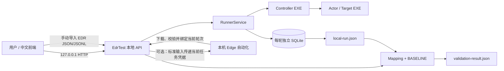

# 本地控制面与一键启动设计

## 1. 定位

前端页面是项目的默认入口，但不承担 EXE 调度、SQLite 写入或比较逻辑。页面只访问本机回环地址上的 `EdrTest serve` API；API 复用现有 `RunnerService`、`ExportService` 和 `CompareService`，因此页面与 CLI 使用同一套执行和验证语义。



## 2. 一键启动

根目录 `启动平台.cmd` 调用 `scripts/Start-EdrTest.ps1`，按顺序完成：

1. 检查 .NET、PowerShell 7、pnpm 与固定端口；
2. 还原并构建 .NET 解决方案；
3. 发布所有已实现能力包到本地 `samples/`，包括 Process、File、Account、Network、Hash、Registry、Scheduled Task、Service、Group Policy、Named Pipe、PowerShell、BITS、WMI 和 Virtual Disk；
4. 安装缺失的前端依赖并构建 Vinext 生产包；
5. 隐藏启动 API 与前端，等待两个服务通过健康检查；
6. 写入 `.edr-test/services.json` 并打开浏览器。

`停止平台.cmd` 读取状态文件，先校验记录的仓库路径和进程命令行，再停止对应服务及其子进程。它不会按进程名批量终止其他 .NET、Node 或 PowerShell 进程。

可用参数：

```powershell
pwsh -NoProfile -File scripts/Start-EdrTest.ps1 `
  -ApiPort 4317 -WebPort 3000 -NoBrowser

# 仅在框架、样本和 web/dist 均为最新时使用
pwsh -NoProfile -File scripts/Start-EdrTest.ps1 -SkipBuild
```

运行日志位于 `.edr-test/logs/`。端口被占用时脚本会直接报错，不会自动漂移到其他端口。

## 3. 本地 API

默认地址为 `http://127.0.0.1:4317`。

| 方法 | 路径 | 用途 |
|---|---|---|
| GET | `/api/health` | 健康状态、版本和能力包数量 |
| GET | `/api/capabilities` | 从本地 `samples/` 发现可执行能力 |
| GET | `/api/baselines` | 返回版本化 BASELINE 摘要 |
| GET | `/api/mappings` | 返回可选云端字段映射 |
| GET | `/api/runs` | 当前进程轮次与本机历史轮次 |
| POST | `/api/runs` | 启动一个或多个能力的真实 Runner 轮次 |
| GET | `/api/runs/{id}` | 查询轮次进度和终态 |
| POST | `/api/runs/{id}/cancel` | 取消并触发 Runner 清理 |
| GET | `/api/runs/{id}/local-export` | 下载 `local-run.json` |
| GET | `/api/runs/{id}/cloud-imports` | 查询当前轮次中校验成功的自动导入记录 |
| GET | `/api/runs/{id}/cloud-imports/{importId}/debug-log` | 下载当前轮次的脱敏云端自动化 JSONL 调试日志 |
| POST | `/api/compare` | multipart 导入云端日志并执行比较 |
| GET | `/api/comparisons/{comparison-id}/progress` | 查询逐能力比较进度和最近一项结论 |
| GET | `/api/reports/{comparison-id}/result` | 下载结构化 JSON 验证结果 |
| GET | `/api/reports/{comparison-id}/conclusion` | 下载中文 Markdown 验证结论 |

`POST /api/compare` 支持两种互斥的云端日志来源：上传 `cloud_file`，或同时提交 `operation_id` 与 `cloud_import_id` 使用该轮次已校验的自动导入记录。手动模式在 `operation_id` 与 `local_file` 中二选一；自动绑定模式固定使用对应轮次的本地导出。可选字段包括 `cloud_manifest`、`mapping_id`、`comparison_id` 和一个或多个 `baseline_id`；未指定 BASELINE 时，API 按本地导出中的能力 ID 自动选择。响应始终是原有的完整 JSON 报告，不混入进度事件。前端预先生成 `comparison_id`，在等待报告期间轮询独立进度接口；比较器每产生一项能力结论就同步更新完成数、参测总数、百分比和该项结论。进度严格按“已完成能力数 ÷ 参测能力总数 × 100%”计算。

比较结果中的每项能力还包含 `local_export_block`、`local_baseline_matches`，每条 `edr_candidates` 则包含独立的 `baseline_matches`。其中的 JSON Pointer 用于把 Canonical 字段准确映射回本地导出块或厂商原始字段，支持前端多候选切换和逐行高亮。

`POST /api/runs` 的 `inter_capability_delay_seconds` 用于设置相邻能力之间的等待时间，范围为 0–300 秒，默认 3 秒。Runner 始终按 `capability_ids` 顺序串行执行；轮次快照同时返回逐能力 `steps`、整体 `progress`、等待倒计时、最近详细 `logs` 和重点 `highlights`。

## 4. 安全边界

- 服务只允许绑定 `localhost`、`127.0.0.1` 或 `::1`；
- 请求 Host 必须是回环地址；浏览器 Origin 必须出现在启动参数允许列表；
- 可使用 `--token` 启用 `X-EDRTest-Token` 本地令牌；
- 单个上传文件上限 256 MB，仅接受 JSON/JSONL；
- 用户导入文件写入 `import/<comparison-id>/`，报告写入 `reports/<comparison-id>/`；
- `samples/`、`runs/`、`import/`、`reports/` 与 `.edr-test/` 均不纳入版本控制；
- 平台不调用腾讯 EDR API；可选自动化仅由本机 Edge 模拟控制台操作。账号和密码只驻留当前后台任务内存，并通过标准输入交给浏览器进程，不进入命令行、环境变量、数据库或运行制品；调试模式仅保存经过 Node/C# 双层凭据脱敏的结构化诊断事件。

## 5. 前端行为

前端始终展示规范化的 16 个活动域和 53 项能力，并拆分为工作台 `/`、进行测试 `/test` 和离线比较 `/compare` 三个路由。只有 API 实际发现的能力包可勾选，其余项目显示“样本待实现”。包含 L2/L3 能力时必须在页面显式确认高风险执行。测试页轮询真实逐能力进度，显示串行步骤、等待倒计时、重点日志和 Controller stdout/stderr；云端自动导入另有独立的百分比、当前阶段、阶段说明和最近事件。用户可启用可见 Edge 调试模式，在页面查看浏览器详细事件，并在终态下载本轮脱敏 JSONL；本地测试终态与云端下载状态分别展示，云端失败不改变本地结论。比较页会发现所选轮次中校验成功的自动导入记录：单份自动选中，多份默认最新并允许切换，没有记录时继续使用手动导入；比较期间每完成一项能力立即更新进度。比较完成后展示总体结论及每条 BASELINE 要求的期望值、实际值和满足状态，每项能力还提供可切换候选块的本地/EDR JSON 对照悬浮窗。
